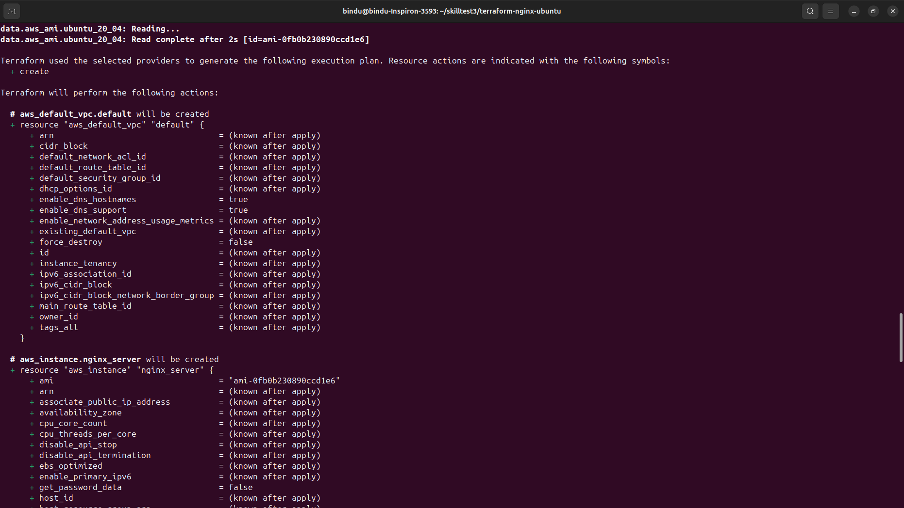
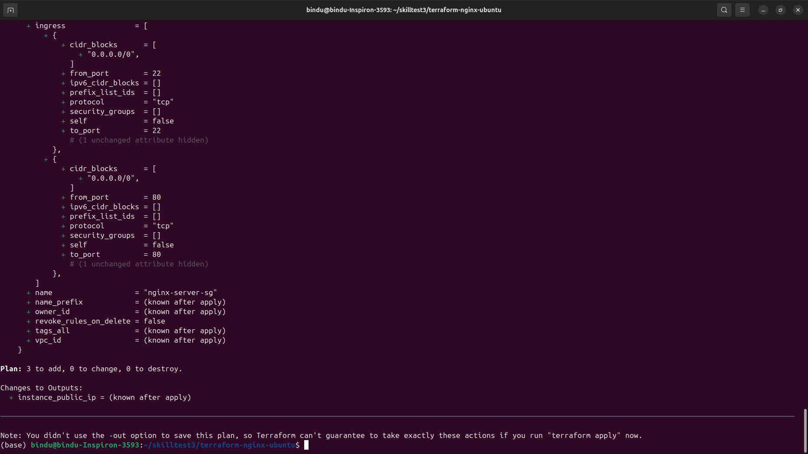
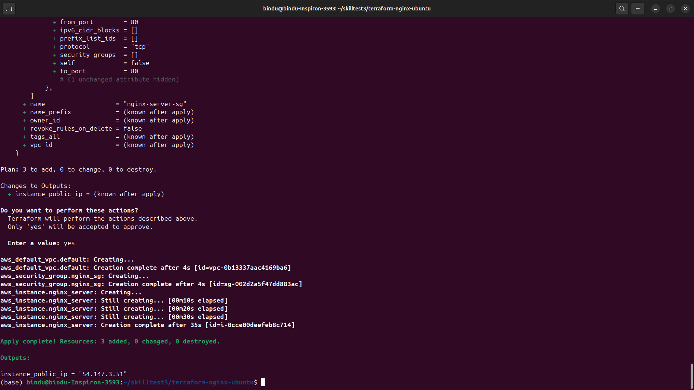
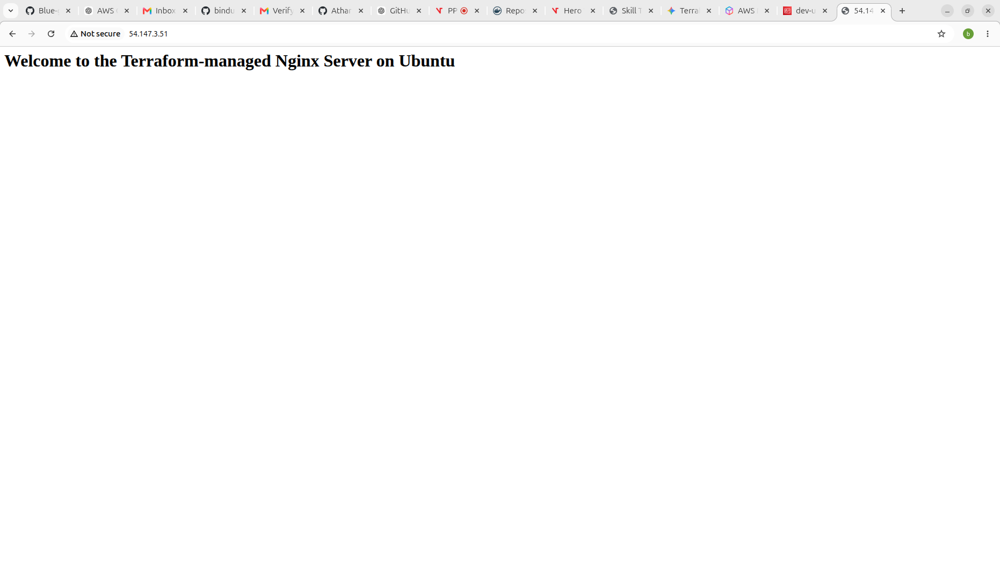
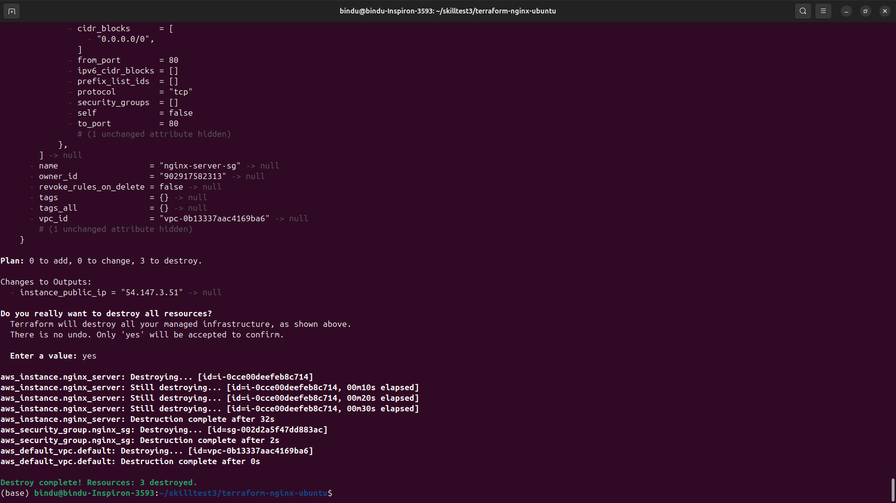

Markdown
# EC2 Nginx Deployment with Terraform

This project demonstrates the use of Infrastructure as Code (IaC) principles by leveraging Terraform to provision an Ubuntu 20.04 LTS EC2 instance running an Nginx web server within the default AWS Virtual Private Cloud (VPC). The deployment includes a custom HTML page served via Nginx and is designed with an emphasis on architectural simplicity, efficiency, and strict adherence to resource constraints.

---

## Architectural Highlights & Efficiency Design
* **Default VPC Re-use:** To adhere to requirements and avoid penalty deductions for unnecessary resource creation, this project actively captures and hooks into the existing AWS `default` VPC network instead of provisioning standalone VPC blocks, Subnets, Internet Gateways, or Route Tables.
* **Dynamic AMI Resolution:** Rather than hardcoding a static Amazon Machine Image (AMI) ID (which can vary or become deprecated across different regions), a live `data` filter query looks up the latest official Canonical Ubuntu 20.04 LTS image.
* **Automated Package Lifecycle:** The EC2 instance leverages a fully non-interactive `user_data` shell execution script that fires dynamically during the hypervisor's initial bootstrap layer to fetch, install, verify, and host the custom application payload seamlessly.

---

## Technical Resources Summary

| Resource Name | Type | Purpose | Network Bound |
| :--- | :--- | :--- | :--- |
| `aws_default_vpc.default` | Managed Resource Hook | Adheres to constraints by latching onto pre-existing default infrastructure without causing unnecessary network resource billing. | Global/Regional Default |
| `aws_security_group.nginx_sg` | Security Group (Firewall) | Orchestrates Stateful Packet Inspection: Inbound HTTP (Port 80) for user traffic, Inbound SSH (Port 22) for administrator terminal access, and Outbound All (`-1`) to enable package mirroring downloads. | Default VPC |
| `aws_instance.nginx_server` | EC2 Compute Instance | Provisions a `t2.micro` compute layer operating on official Canonical Ubuntu Focal 20.04 LTS media executing custom server boots. | Default VPC Subnet |

---

## Implementation Code

### 1. `variables.tf`
Defines configurable parameters to make the template decoupled, environment-agnostic, and reusable.
```hcl
variable "aws_region" {
  description = "The target AWS region for resource deployment."
  type        = string
  default     = "us-east-1"
}

variable "instance_type" {
  description = "The hardware sizing allocation metric for the compute layer."
  type        = string
  default     = "t2.micro"
}

variable "key_name" {
  description = "Optional cryptographic keypair string identifying an existing AWS SSH registration key."
  type        = string
  default     = null
}
```
### 2. `main.tf`
Houses the core architectural blueprint declaration, complete with embedded inline validation logic.
```
Terraform
# ==============================================================================
# 1. PROVIDER & VERSION SPECIFICATIONS
# ==============================================================================
terraform {
  required_providers {
    aws = {
      source  = "hashicorp/aws"
      version = "~> 5.0" # Lock versioning strictly onto stable 5.x releases
    }
  }
}

provider "aws" {
  region = var.aws_region
}

# ==============================================================================
# 2. DATA DISCOVERY QUERIES
# ==============================================================================

# Dynamically discover the latest verified Ubuntu 20.04 LTS AMD64 image
data "aws_ami" "ubuntu_20_04" {
  most_recent = true
  owners      = ["099720109477"] # Canonical's official immutable vendor ID

  filter {
    name   = "name"
    values = ["ubuntu/images/hvm-ssd/ubuntu-focal-20.04-amd64-server-*"]
  }

  filter {
    name   = "virtualization-type"
    values = ["hvm"]
  }
}

# ==============================================================================
# 3. NETWORK CONNECTOR ADAPTER
# ==============================================================================

# Adopt the existing Default VPC wrapper to strictly avoid creating unneeded resources
resource "aws_default_vpc" "default" {}

# ==============================================================================
# 4. STATEFUL STRUCTURAL FIREWALL (SECURITY GROUP)
# ==============================================================================
resource "aws_security_group" "nginx_sg" {
  name        = "nginx-server-sg"
  description = "Enforces baseline ingress security posture rules for port 80 and port 22 access"
  vpc_id      = aws_default_vpc.default.id

  # Rule Component: Inbound Web Request Handlers
  ingress {
    description = "Allow inbound public user agent HTTP requests"
    from_port   = 80
    to_port     = 80
    protocol    = "tcp"
    cidr_blocks = ["0.0.0.0/0"]
  }

  # Rule Component: Administrative Remote Shell Operations
  ingress {
    description = "Allow secure remote shell administration connections"
    from_port   = 22
    to_port     = 22
    protocol    = "tcp"
    cidr_blocks = ["0.0.0.0/0"]
  }

  # Rule Component: Outbound Mirrors Link Verification
  # CRITICAL: Vital to open egress so Ubuntu can download Nginx binary binaries from packages.ubuntu.com
  egress {
    description = "Allow all outbound tracking connectivity requests"
    from_port   = 0
    to_port     = 0
    protocol    = "-1" # Equivalent to matching any transmission layer payload
    cidr_blocks = ["0.0.0.0/0"]
  }

  tags = {
    Name        = "nginx-server-sg"
    Environment = "Assignment"
    ManagedBy   = "Terraform"
  }
}

# ==============================================================================
# 5. COMPUTE ENGINE LAYER & BOOT EXECUTION CONTEXT
# ==============================================================================
resource "aws_instance" "nginx_server" {
  ami                    = data.aws_ami.ubuntu_20_04.id
  instance_type          = var.instance_type
  key_name               = var.key_name
  vpc_security_group_ids = [aws_security_group.nginx_sg.id]

  # Non-interactive shell interpreter string mapping for continuous delivery automation
  user_data = <<-EOF
              #!/bin/bash
              # Halt operational flows on errors and guarantee immediate package indexing updates
              set -e
              apt-get update -y
              
              # Force continuous installation of Nginx runtime without interactive UI blocks
              DEBIAN_FRONTEND=noninteractive apt-get install -y nginx
              
              # Bootstrap initial daemon states
              systemctl start nginx
              systemctl enable nginx
              
              # Inject custom HTML criteria matching task scope precisely
              echo "<h1>Welcome to the Terraform-managed Nginx Server on Ubuntu</h1>" > /var/www/html/index.html
              EOF

  # Strict resource mapping parameters
  tags = {
    Name        = "Terraform-Nginx-Ubuntu-Server"
    Environment = "Assignment"
    ManagedBy   = "Terraform"
  }
}
```
### 3. `outputs.tf`
Tracks metadata targets and pushes real-time dynamic runtime states into your local console screen.
```
Terraform
output "instance_public_ip" {
  description = "The public IP address exposed by the newly provisioned EC2 engine instance."
  value       = aws_instance.nginx_server.public_ip
}
```
---

## Deployment & Execution Playbook
Execute all specified operations using Terraform CLI binary endpoints from inside your active directory terminal profile.
```
Step 1: Subsystem Initialization
Prepares local environments, mapping state backends and downloading the respective cloud API integration frameworks.

Bash
terraform init
Step 2: Architecture Dry-Run Compilation
Compiles a speculative structural delta blueprint graph. Use this to verify that exactly 2 resources will be appended to your ecosystem with zero network disruptions.

Bash
terraform plan
Step 3: Core Convergence Operations
Validates changes and starts live remote API scheduling commands.

```

Example plan output:

### After Plan execution


Bash
terraform apply
Interactive Prompt: Review terminal messages, key in yes, and hit Enter.

### Apply


Output Processing: Once the orchestration process concludes, copy the logged instance_public_ip token parameter string printed on screen.

### Outputs

```
Step 4: Workload Verification
Give the underlying hardware initialization matrix roughly 60-90 seconds to finish processing the execution array inside the package download manager.

Direct any standard web browser application engine to the logged IP string, for example: http://<YOUR_INSTANCE_PUBLIC_IP>.

```
### nginx output page



Verify that your landing view successfully renders: "Welcome to the Terraform-managed Nginx Server on Ubuntu".

Capture a clean screenshot displaying the complete browser navigation field view alongside this page header for your course portal submission package.


Step 5: Clean Teardown Operations
Completely reverse all operational setups and clean out all active cloud objects to guarantee zero orphaned resource charges.

Bash
terraform destroy
Key in yes when prompted to verify full teardown confirmation.

### After Applying Destroy 


